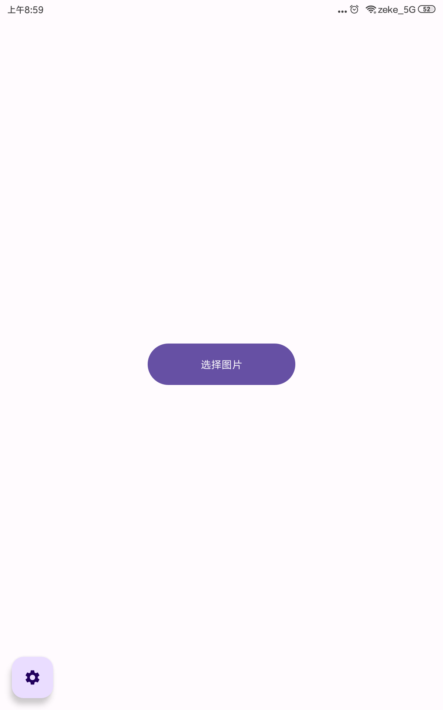
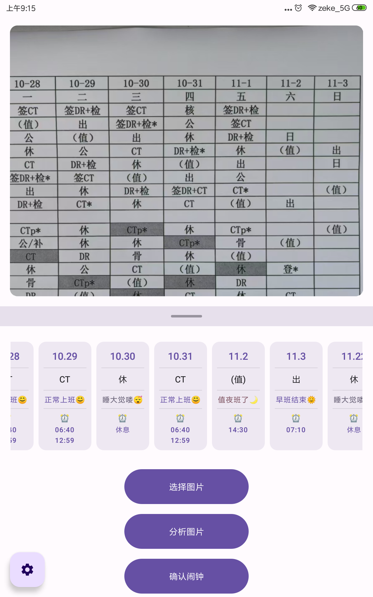
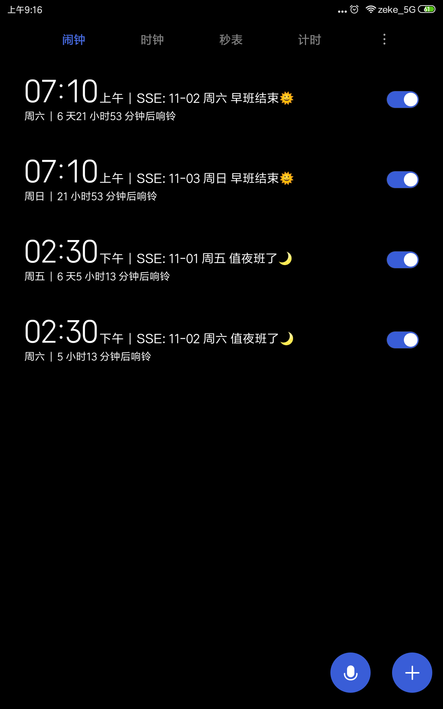

# 智眼排班 SmartScheduleEye

## 预览

|                主页面                |               功能页面               |               闹钟                |
| :--------------------------------: | :------------------------------: | :-------------------------------: |
|  |  |  |

## 规则

- CT = DR = 体检 =（DR+体检）= 8.上班
- 日 = * = 16.下班
- 公 = 休 = 睡大觉
- 值 = 16.上到第二天8.
- 出 = 早上8.下班回家睡大觉

--------------------------------
- 值夜班了🌙 - 14:30
- 夜班结束🌞 - 07:10
- 睡大觉喽😴
- 正常上班😊 - 06:40  12:59
- 没有午休😭 - 06:40  12:59    
- 未知班次❓ 
